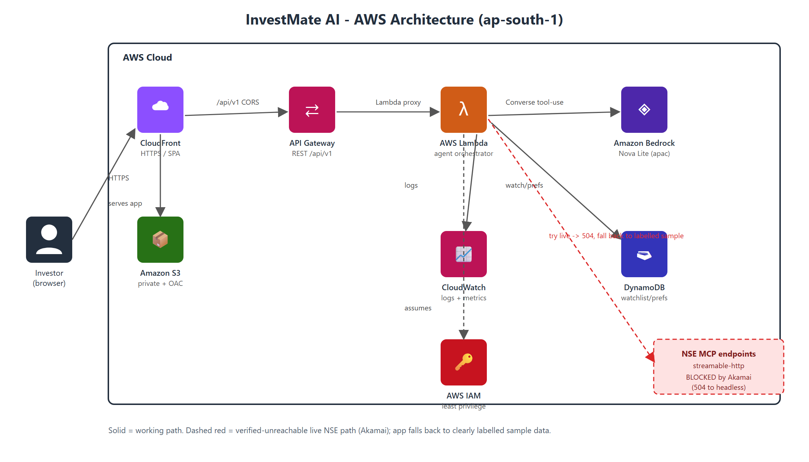
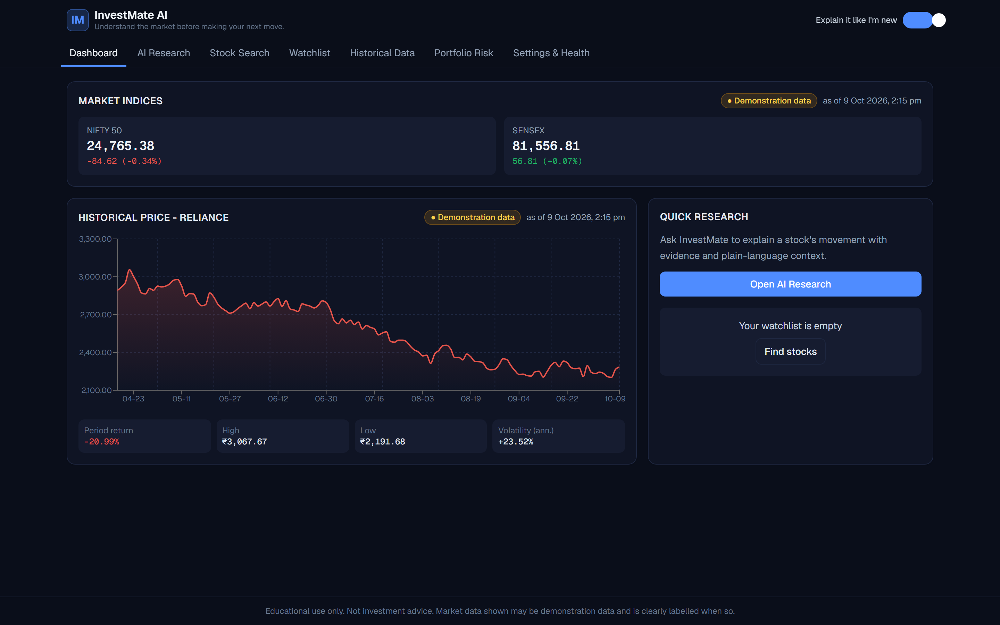
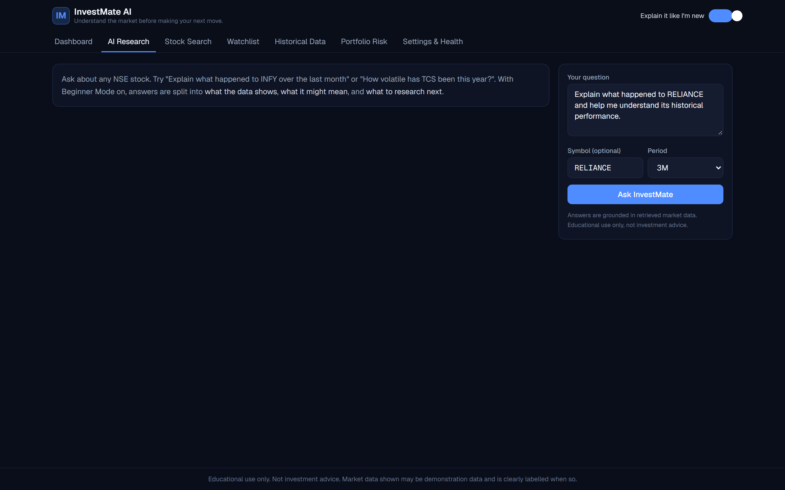
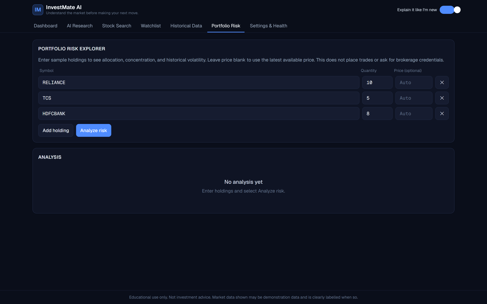
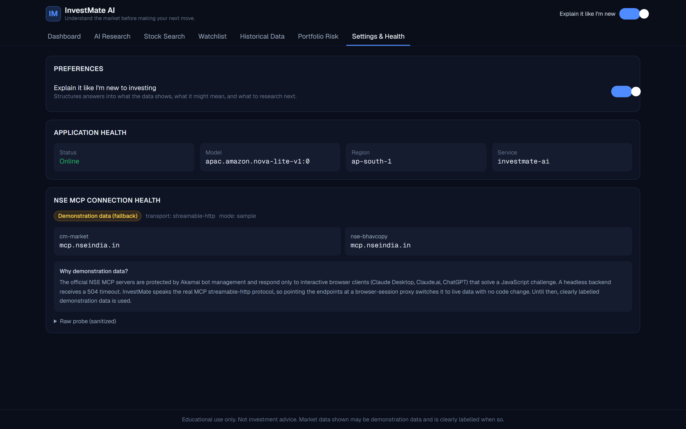

# InvestMate AI

> Understand the market before making your next move.

InvestMate AI is an AI-powered investment research companion for Indian retail
investors. Ask a plain-English question about an NSE-listed stock and get an
evidence-grounded explanation, historical charts, a watchlist, and a basic
portfolio-risk view, with a **Beginner Mode** that explains everything in
plain language.

Built for the AWS Builder Center "Build an Agent" weekend challenge.

## Live demo

- App: https://d2x3869ki4yvj9.cloudfront.net
- API health: https://yrdnvo6e7c.execute-api.ap-south-1.amazonaws.com/prod/api/v1/health

## Architecture



React SPA on CloudFront + S3, calling API Gateway, a Python Lambda agent
orchestrator, Amazon Bedrock (Nova Lite) with controlled tool use, DynamoDB, and
CloudWatch. Editable source: `docs/architecture-aws.drawio` (official AWS icons).

## Screenshots

| Dashboard | AI Research |
|---|---|
|  |  |

| Portfolio Risk | Settings and Connection Health |
|---|---|
|  |  |

## Repository layout

```
backend/     Python AWS Lambda: agent orchestrator, MCP adapter, API handlers
frontend/    React + TypeScript + Vite + Tailwind + Recharts SPA
infra/        (SAM template lives at backend/template.yaml)
docs/        Deployment guide, teardown, and Builder Center article draft
```

## Important: NSE MCP data source

The official NSE MCP endpoints (`cm-market`, `nse-bhavcopy`) are fronted by
Akamai Bot Manager and only respond to interactive browser/desktop clients
(Claude Desktop, Claude.ai, ChatGPT) that solve a JavaScript challenge. A
headless backend (Lambda) receives `504 Gateway Time-out`. This was verified
during development.

InvestMate AI therefore speaks the **real MCP `streamable-http` protocol** and
will use live NSE tools automatically if an endpoint becomes reachable from the
runtime (the base URLs are configurable, so a browser-session proxy can be
dropped in). Until then it falls back to a **clearly labelled, deterministic
sample-data provider**. The app never presents sample data as live NSE data.

See `docs/DEPLOYMENT.md` for setup and `docs/ARTICLE.md` for the write-up.

## Quick start (local)

```bash
# backend
cd backend
python -m venv .venv && . .venv/Scripts/activate   # Windows: .venv\Scripts\Activate.ps1
pip install -r requirements.txt
python -m pytest            # run tests
python local_server.py      # run API locally on http://localhost:8000

# frontend
cd ../frontend
npm install
npm run dev                 # http://localhost:5173
```

## Contributing

Contributions are welcome. See [CONTRIBUTING.md](CONTRIBUTING.md) for setup,
coding conventions, and the data-honesty guarantees the project maintains.

## License

Released under the [MIT License](LICENSE).

## Disclaimer

InvestMate AI is for educational use only and is not investment advice. Market
data shown may be demonstration data and is clearly labelled when so.
