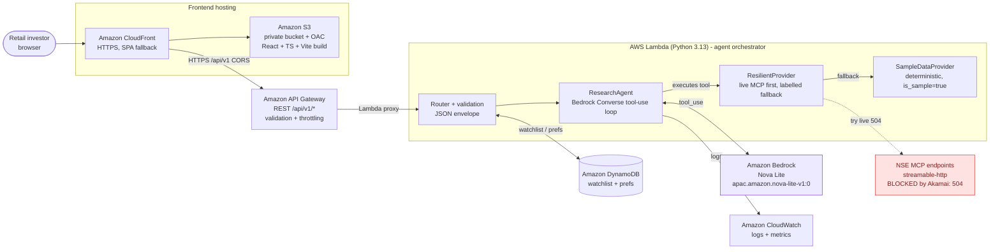

# InvestMate AI - Architecture

Request flow: React SPA (CloudFront + S3) to API Gateway to a Python Lambda
agent orchestrator, which calls Amazon Bedrock (Nova Lite) with controlled
tool use and fetches data through a resilient provider. The live NSE MCP path is
verified-unreachable from a headless runtime (Akamai bot protection returns a
504), so the app falls back to clearly labelled sample data. An editable
diagram is in `architecture.drawio`.

